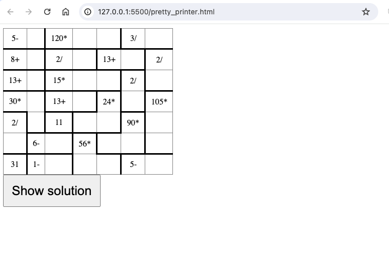

### Extended Task:

We have provided an additional file pretty.py to perform this task. It expects a file path
to be passed to a json file that is the output of running the fetch.sh command that was provided to us
in the project description. I have not provided the fetch file, but an example json file has been included in this submission. To run, enter: ```python3 pretty.py``` which will generate an html file. 
Viewing this html file in the browser will display an html table similar to this:


